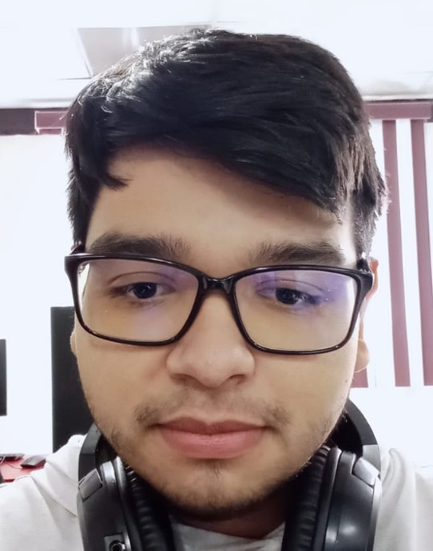

# LHDI Mi comunidad en la web
Los estudiantes crearán una página web de una sola sección dedicada a un lugar significativo o un aspecto cultural de su comunidad (por ejemplo, el mercado local, una plaza histórica, una festividad tradicional o un área natural).

Nombres: Daniel Ivan
Apellidos: Leyva Holguin
Grado y grupo: 3-D
Correo: 24308060610008@cetis61.edu.mx

